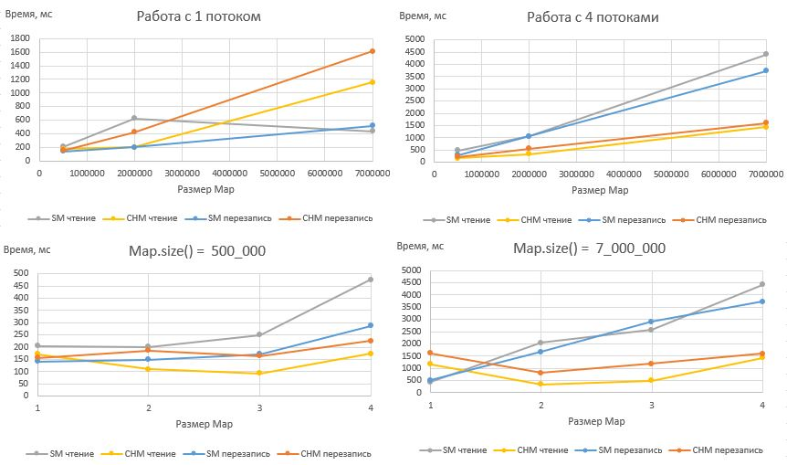

### Модуль 5. Многопоточное программирование

## Домашнее задание к занятию 1.4 Коллекции для параллельной (конкурирующей) работы.

Итак, давайте немного попрактикуем материал, который был пройден на лекции.

Необходимо выполнить и предоставить на проверку следующие задачи:

1. [Колл-центр](./src/task1/README.md);
2. [Разница в производительности](./src/task2/README.md) (задача со звездочкой *);

*Приложение к задаче 2**
[(Тесты ConcurrentMap.xlsx)](./resources/ConcurrentMapTests.xlsx)

=======

Задачи со звездочкой `*` необязательны для получения зачета.